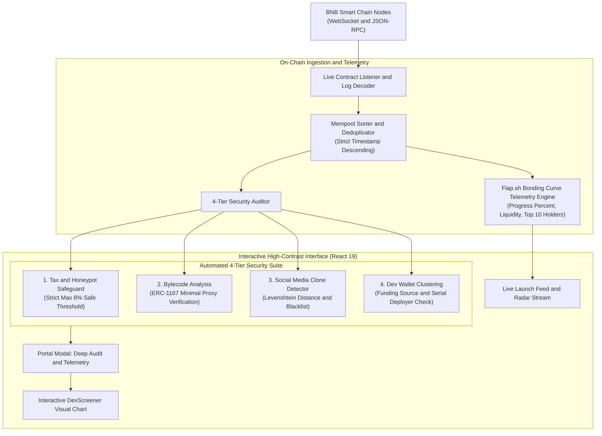

# Inception Flap Scanner

[](LICENSE)
[](Dockerfile)
[](https://bscscan.com)
[](#)
[](https://huggingface.co/spaces/Lucace/inception-flap-scanner)
[](#-automated-4-tier-security-auditor)
[](https://github.com/ahmet/awesome-web3/blob/main/README.md#L345)
[](https://github.com/Lukecele/inception-flap-scanner)

A real-time on-chain token launch screener, Flap.sh bonding curve telemetry tracker, and automated 4-tier contract security auditor on **BNB Smart Chain (BSC)**. Fully containerized with Docker and continuously deployed on Hugging Face Spaces.

**Live Application:** [https://lucace-inception-flap-scanner.hf.space](https://lucace-inception-flap-scanner.hf.space)  
**Awesome-Web3 Directory:** [Risk Management (Line 345)](https://github.com/ahmet/awesome-web3/blob/main/README.md#L345) ([Merged PR #795](https://github.com/ahmet/awesome-web3/pull/795))  
**Hugging Face Space:** [https://huggingface.co/spaces/Lucace/inception-flap-scanner](https://huggingface.co/spaces/Lucace/inception-flap-scanner)  
**License:** [MIT](./LICENSE)

---

## 🏛️ System Architecture



---

## 🚀 Key Features

### 1. Real-Time On-Chain Launch Ingestion
- Listens directly to BNB Smart Chain block events and Flap.sh contract factory logs via high-speed RPC and WebSocket connections.
- Deduplicates incoming token launches and sorts them strictly in real-time chronological order.

### 2. Automated 4-Tier Security Auditor
Before interacting with any newly deployed token, the built-in deterministic auditor analyzes 4 vulnerability vectors:
1. **Tax & Honeypot Safeguard (≤8% Threshold):** Automatically queries buy and sell tax rates. Any token with taxes exceeding 8% is flagged as predatory (accounting for Flap's 1% platform fee, guaranteeing a total transaction tax under 9%).
2. **ERC-1167 Minimal Proxy Verification:** Decodes runtime bytecode against official Flap minimal proxy implementations (`0x363d3d373d3d3d363d73...5af43d82803e903d91602b57fd5bf3`), flagging unverified, custom, or suspicious contract proxies.
3. **Social Clone & Phishing Detection:** Flags token impersonators, copycats, and duplicate social media handles (Twitter/X, Telegram) matching known projects.
4. **Dev Wallet Clustering & Funding Origin:** Classifies deployer funding wallets (CEX/bridge vs. fresh private addresses) and tracks serial deployer history.

### 3. Flap.sh Bonding Curve Telemetry
- Real-time bonding curve accumulation progress towards DEX migration (target: $12,000 liquidity / 100% curve fill).
- Tracks Market Cap (USD), Curve Liquidity (USD), Top 10 Holders concentration rate, and Developer Token Holding percentage.
- Embedded DexScreener chart viewer for real-time candlestick price action.

### 4. Non-Custodial Architecture & Zero-Secret Reliability
- Operates 100% non-custodial and read-only.
- Requires zero private keys, zero wallet credentials, and zero mandatory external API keys out-of-the-box.

---

## 🛠️ Tech Stack

- **Runtime:** Node.js 22 LTS (Alpine Linux)
- **Frontend:** React 19, Vite, Lucide Icons, Modern CSS3 with Mobile Acceleration
- **Web3 & RPC:** Ethers.js v6, BSC DataSeed RPCs
- **Containerization & Hosting:** Docker (`Dockerfile`, EXPOSE 7860), Hugging Face Spaces (Docker SDK)

---

## 🧪 Automated Testing Suite

The security auditor and telemetry engine are validated by an automated unit test suite:

```bash
# Run all unit tests
npm test
```

Tests cover:
- Tax risk bounds and threshold boundary validation (≤8% safe vs >8% predatory)
- ERC-1167 minimal proxy bytecode matching and unverified proxy rejection
- Social media handle copycat detection and duplicate detection
- Developer wallet clustering and transaction volume classification
- Bonding curve percentage clamping and edge case calculations
- Mempool chronological descending order sorting

---

## 🐳 Local Development (Docker)

```bash
# Build the Docker image
docker build -t inception-flap-scanner .

# Run container on port 7860
docker run -p 7860:7860 inception-flap-scanner
```

Visit [http://localhost:7860](http://localhost:7860) to view the scanner dashboard.

---

## 🌐 Directory Indexing

- **[Awesome-Web3 Directory](https://github.com/ahmet/awesome-web3):** Officially reviewed and indexed under [Risk Management (Line 345)](https://github.com/ahmet/awesome-web3/blob/main/README.md#L345) via [Merged PR #795](https://github.com/ahmet/awesome-web3/pull/795).

---

## ⭐ Support the Project

If you find this real-time screener or 4-tier security auditor useful for your research, monitoring, or on-chain tooling, please consider dropping a **Star** on GitHub. It directly supports open-source development and ecosystem maintenance!

[](https://github.com/Lukecele/inception-flap-scanner)

---

## 📄 License

Released under the [MIT License](./LICENSE).
